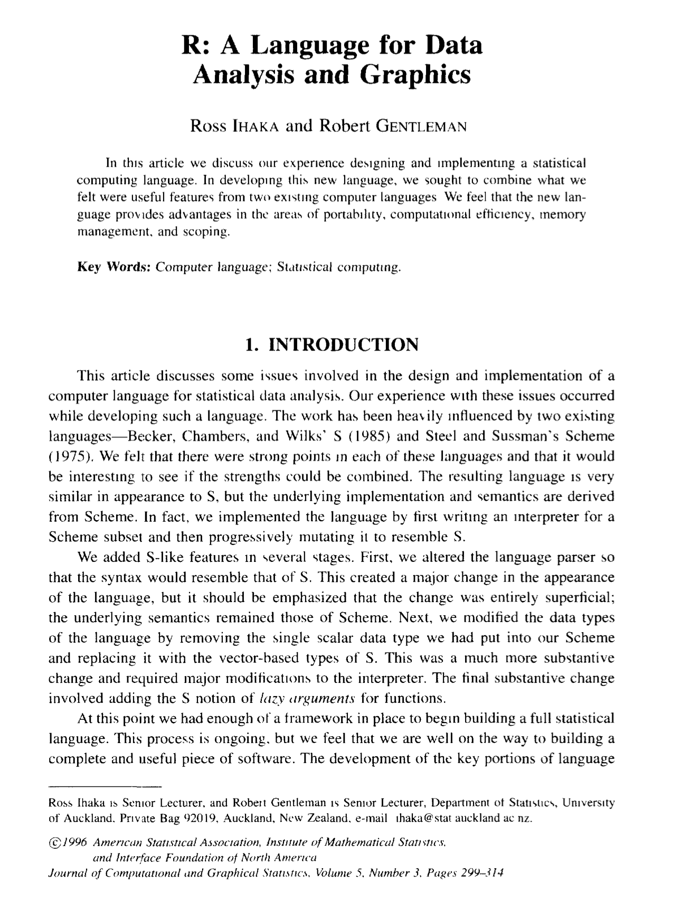

# **useR**. Intro to R and basic features

```{r message=FALSE, echo=FALSE}
library(tidyverse)
library(kableExtra)
```


## Welcome R user 

- **R** is a programming language designed for:
  - Statistical computing
  - Data analysis
  - Visualization
  

```{r echo=FALSE, fig.align='center'}
knitr::include_graphics(here::here('images/rpages.png'))
```

[Download R](https://www.r-project.org)


```{r echo=FALSE,  fig.align='center'}
knitr::include_graphics(here::here('images/rpages.png'))
```

[Download Rstudio](https://posit.co/download/rstudio-desktop/)

## ¿Why learn R? 


- Open source and free  
- big community  
- ~ 13.000 packages  
- Reproducible science

is just this

```{r echo=FALSE,  fig.align='center'}
knitr::include_graphics(here::here('images/calc.jpg'))
```

but... 

## Origin of R

Seminal paper or R! [here](http://www.aliquote.org/cours/2012_biomed/biblio/Ihaka1996.pdf) (Fig. \@ref(fig:semi)).

```{r semi, echo=FALSE, fig.align='center', fig.cap= "Seminal Paper of R"}

```

## Getting Started


1. Install R from [CRAN](https://cran.r-project.org)
2. Install RStudio (optional, but highly recommended)
3. Write your first R command:

```{r echo= TRUE}
print("Hello, world!")
```


## Basic Data Types

- **Numeric:** Numbers (e.g., `3.14`, `42`)
- **Character:** Text strings (e.g., `"fish"`)
- **Logical:** `TRUE` or `FALSE`
- **Factor:** Categorical variables


## Vectors

- R's most fundamental data structure:
```{r}
numbers <- c(1, 2, 3, 4)
letters <- c("a", "b", "c")
```
- Operations are vectorized:
```{r}
numbers * 2
```

## Data Frames

- Table-like structures:
```{r}
df <- data.frame(Name = c("John", "Jane"), Age = c(25, 30))
```
- Inspect the structure:
  
```{r}
head(df)
```

## Visualization

- Example base plot:

Data used

```{r}
kbl(head(iris))
```


```{r fig.align='center'}
plottex <- ggplot(iris, 
       aes(x = Sepal.Length, 
           y = Species)) + 
  geom_bar(stat = "identity")
plottex
```


```{r  fig.align='center'}
plottex <- ggplot(iris, 
       aes(x = Sepal.Length, 
           y = Species)) + 
  geom_bar(stat = "identity")+
  theme_minimal()
plottex
```


```{r  fig.align='center'}
plottex <- ggplot(iris, 
       aes(x = Sepal.Length, 
           y = Species)) + 
  geom_bar(stat = "identity")+
  theme_minimal()+
  coord_flip()
plottex
```


## Functions

- Encapsulate reusable logic:

```{r}
square <- function(x) {
     return(x^2)
   }
square(4)  # Output: 16
```


## Statistical Analysis {.columns-2}


- Linear regression example:
```{r}
fit <- lm(mpg ~ wt, data = mtcars)

```

```{r}
summary(fit)
```

## Conclusion

- R is powerful for:
  - Data analysis
  - Visualization
  - Statistics


## Sources

Source in this [link](https://estadistica-dma.ulpgc.es/cursoR4ULPGC/index.html)

[An introduction to R](https://intro2r.com/index.html)
